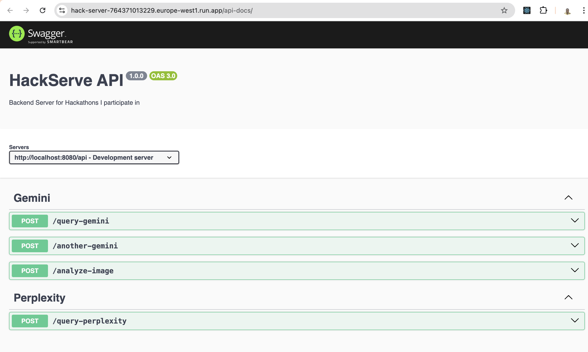

# Hack-Server

## Overview

Hack-Server is a backend Express server built with TypeScript to support various hackathon projects. It currently features integration with Google's Gemini AI API for medical symptom analysis.

## Project Deployment
[](https://hack-server-764371013229.europe-west1.run.app/api-docs)


## Features

- RESTful API endpoints using Express
- Google Gemini AI integration for medical diagnosis
- Perplexity AI integration for medical diagnosis
- Swagger documentation for API endpoints
- TypeScript for type safety
- Environment variable support with dotenv

## Getting Started
### Prerequisites

- Node.js (v20 or later recommended)
- npm or yarn

### Installation

1. Clone the repository

```bash
git clone <repository-url>
cd hack-server
```

2. Install dependencies

```bash
npm install
```

3. Create a `.env` file in the root directory (or update the existing one) with the following content:

```plaintext
GEMINI_API_KEY=your_gemini_api_key_here
SONAR_API_KEY=your_sonar_api_key_here
PORT=3000
```

## Development Server

To start the development server with hot reloading:

```bash
npm run dev
```

Building for production
```bash
npm run build
```

Running in production
```bash
npm start
```

## API Documentation
API documentation is available via Swagger UI at `/api-docs` when the server is running.



## Project Structure

```
.
├── .env                  # Environment variables
├── .gitignore            # Git ignore file
├── package.json          # Project dependencies and scripts
├── tsconfig.json         # TypeScript configuration
├── README.md             # Project documentation
└── src/                  # Source code directory
    ├── controllers/      # API controllers
    │   └── gemini.ts     # Gemini AI controller
    │   └── perplexity.ts     # Perplexity AI controller
    └── routes/           # API routes
        └── gemini_routes.ts  # Gemini routes definition
        └── perplexity_routes.ts  # Perplexity routes definition
├── app.ts            # Main application entry point
```

## LICENSE
MIT License

## Authors
[StormGear](https://github.com/StormGear) <br/>
[papakofi](https://gitlab.com/papakofi)


